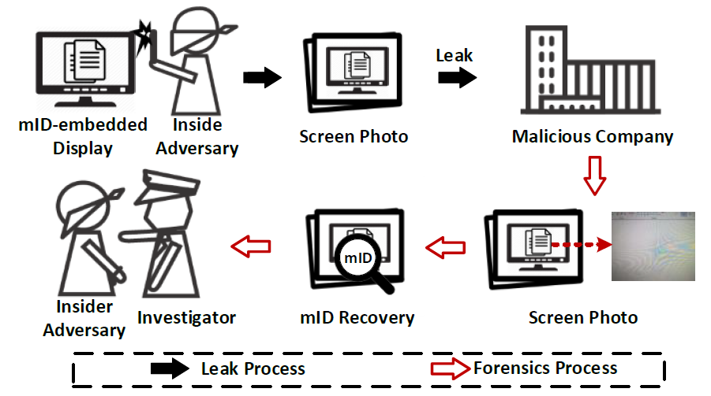
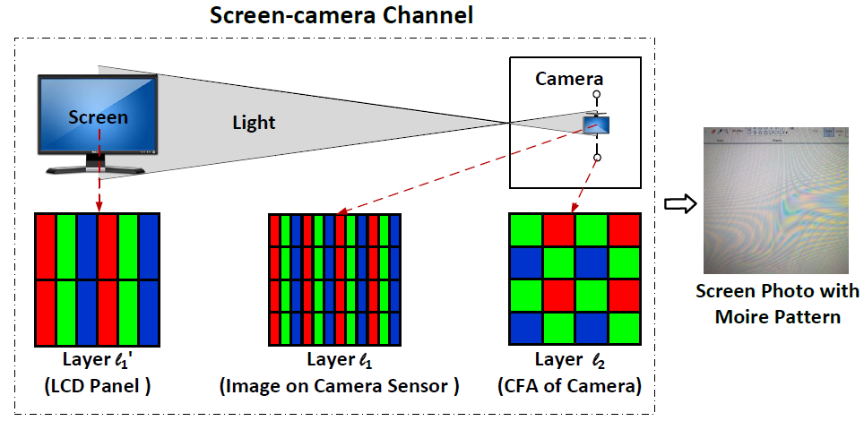
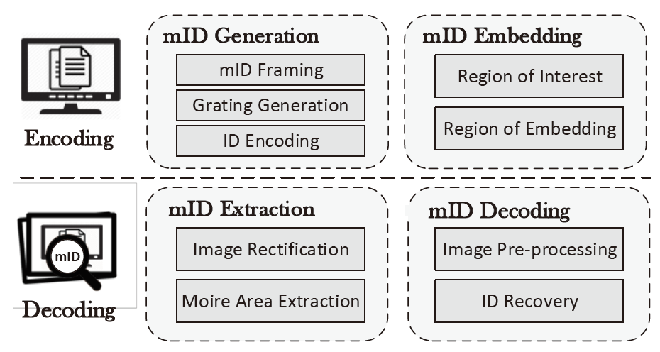
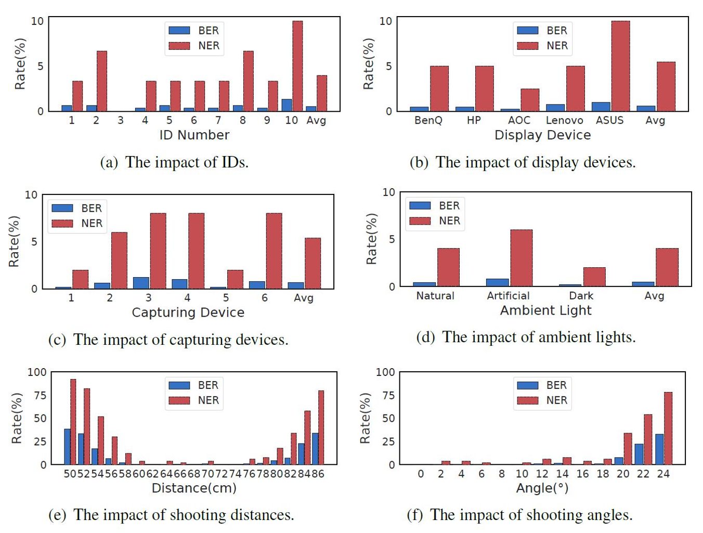

# What is mID?

Cyber-theft of trade secrets has become a serious business threat. Digital watermarking is a popular technique to assist in identifying the source of the file leakage, whereby a unique watermark for each insider is hidden in sensitive files. However, malicious insiders may use their smartphones to photograph the secret file displayed on screens to remove the embedded hidden digital watermarks due to the optical
noises introduced during photographing. To identify the leakage source despite such screen-photo-based leakage attacks, we leverage Moiré pattern, an optical phenomenon resulted from the optical interaction between electronic screens and cameras. As such, we present mID, a new watermark-like technique that can create a carefully crafted Moiré pattern on the photo when it is taken towards the screen. We design patterns that appear to be natural yet can be linked to the identity of the leaker.We implemented mID and evaluate it with 5 display devices and 6 smartphones from various manufacturers and models. The results demonstrate that mID can achieve an average bit error rate (BER) of 0:6% and can successfully identify an ID with an average accuracy of 96%, with little influence from the type of display devices, cameras, IDs, and ambient lights. 

## How does mID work?



# Background

## Moiré Pattern

Moiré patterns or Moiré fringes are interference patterns created when opaque ruled patterns with transparent gaps are overlaid.



## Threat Model

- Screen-capturing with Smartphones.
- Untraceability over Internet.
- Photo Processing.

## Overview of mID



# Performance

We conduct experiments under various settings and collect over 5000 photos with 5 display devices and 6 smartphones over 3 months.

• mID achieves an average BER of 0.6% and an average NER of 4.0%, which demonstrates promises towards
screen photo forensics.
• mID performs well with little influence from the type of display devices, cameras, IDs, and ambient lights.
• mID performs well at a shooting distance of (60cm;80cm) and a shooting angle of (-20°;20°),
which are within the possible attack distances and angles adopted by adversaries as suggested by the theoretical calculation.



# Citation

```
@inproceedings{cheng2021mid,
  title={mID: Tracing Screen Photos via Moir{\'e} Patterns},
  author={Cheng, Yushi and Ji, Xiaoyu and Wang, Lixu and Pang, Qi and Chen, Yi-Chao and Xu, Wenyuan},
  booktitle={30th $\{$USENIX$\}$ Security Symposium ($\{$USENIX$\}$ Security 21)},
  year={2021}
}
```

# Contact
* Prof. Wenyuan Xu (<wyxu@zju.edu.cn>)
* Prof. Xiaoyu Ji (<xji@zju.edu.cn>)
* Dr. Yushi Cheng (yushicheng@zju.edu.cn)

# Powered by

<table bgcolor="white">
<tr valign="middle">
<td width="50%" align="center" colspan="2">
 <a href="http://usslab.org">Ubiquitous System Security Laboratory (USSLab) 
</td>
<td width="50%" align="center" colspan="2">
  <a href="http://www.zju.edu.cn/english">Zhejiang University 
</td>
</tr>
<tr valign="middle">
<td width="50%" align="center" colspan="2">
  <a href="http://usslab.org"></a>
  <a href="http://usslab.org"></a>
</td>
<td width="50%" align="center" colspan="2">
  <a href="http://www.zju.edu.cn/english/"></a>
  <a href="http://www.zju.edu.cn/english/"></a>
</td>
</tr>
</table>
